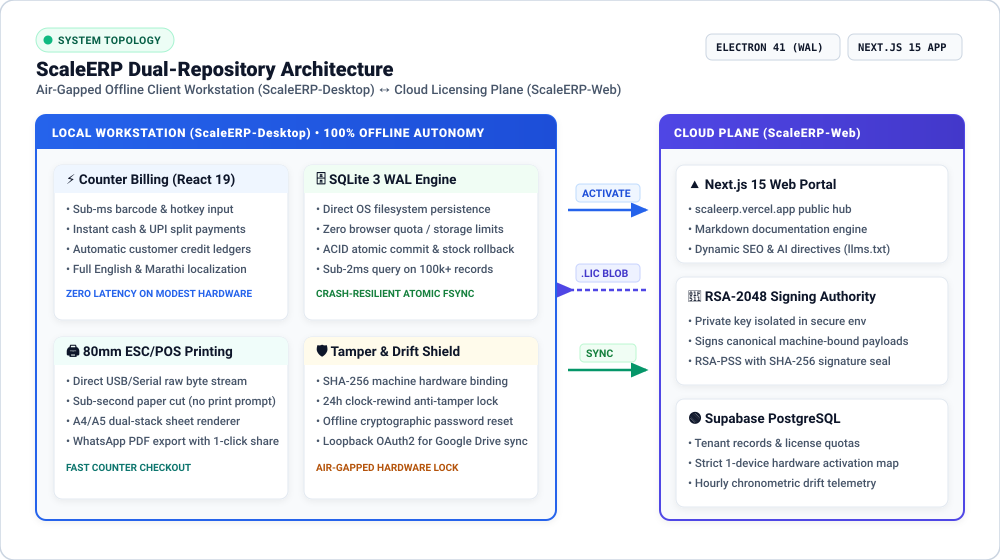
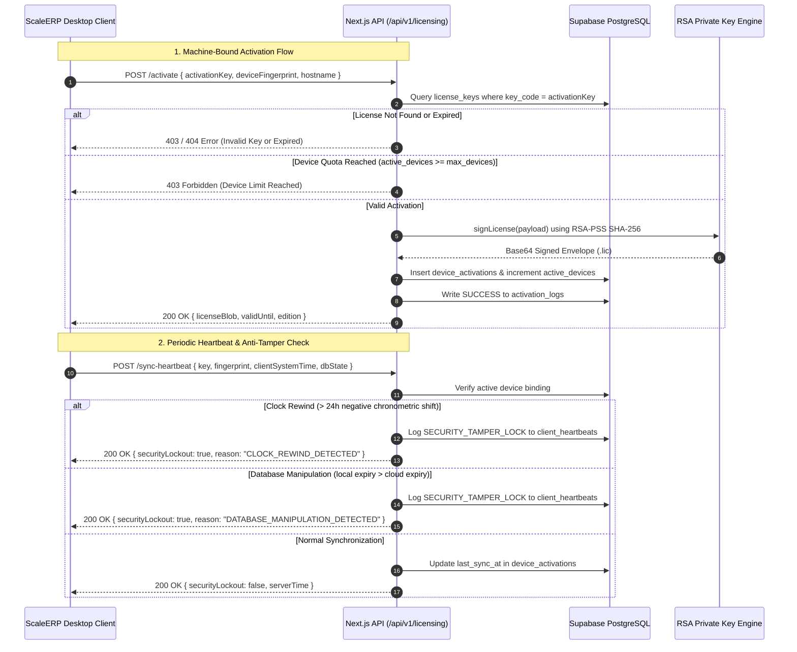

<div align="center">

  

  <h1>ScaleERP Web</h1>

  <p><b>Cloud control plane, cryptographic licensing authority, and knowledge portal for the ScaleERP ecosystem.</b></p>

  <p>
    <a href="https://scaleerp.vercel.app"></a>
    <a href="https://github.com/adityapawar112/ScaleERP-Desktop"></a>
    
    
    
    
    
    
  </p>

  <p>
    <a href="https://scaleerp.vercel.app"><b>Live Cloud Portal</b></a> &nbsp;•&nbsp;
    <a href="https://github.com/adityapawar112/ScaleERP-Desktop"><b>Desktop Client Repository</b></a> &nbsp;•&nbsp;
    <a href="#-licensing-lifecycle--sequence-architecture"><b>Licensing Architecture</b></a> &nbsp;•&nbsp;
    <a href="#-api-endpoint-specifications"><b>API Reference</b></a> &nbsp;•&nbsp;
    <a href="#-environment-configuration"><b>Environment Setup</b></a>
  </p>

</div>

---

## ⚡ Role in the ScaleERP Ecosystem

ScaleERP-Web provides the cloud management and licensing layer for the ScaleERP ecosystem without compromising the client application's offline independence. It fulfills three critical functions:

1. **Cryptographic Root of Trust**: Securely stores the RSA-2048 private key in isolated server environments. It signs canonical JSON payloads to mint machine-bound `.lic` license files for the [ScaleERP-Desktop](https://github.com/adityapawar112/ScaleERP-Desktop) client.
2. **Entitlements & Telemetry Server**: Maintains tenant records, active hardware bindings, and chronometric audit logs in Supabase PostgreSQL, enforcing device quotas and detecting client clock tampering.
3. **Marketing & Knowledge Hub**: Serves dynamic markdown documentation, industry operational guides, and SEO metadata routes (`robots.ts`, `sitemap.ts`, and structured AI engine directives in `llms.txt`).

---

## 🏛️ Ecosystem Topology

The web portal interacts with the offline desktop client through a structured cryptographic handshake:

<div align="center">
  
</div>

---

## 🔐 Licensing Lifecycle & Sequence Architecture

The licensing engine decouples license issuance from daily client runtime. The desktop app contacts ScaleERP-Web only for initial machine activation and periodic background synchronization.



---

## 📡 API Endpoint Specifications

All endpoints are built using Next.js 15 App Router route handlers with strict payload validation:

| Endpoint | Method | Auth Required | Description |
| :--- | :---: | :---: | :--- |
| `/api/v1/licensing/activate` | `POST` | Public Key Code | Verifies device fingerprint, allocates device quota, and returns an RSA-signed `.lic` blob. |
| `/api/v1/licensing/sync-heartbeat` | `POST` | Hardware Token | Audits workstation time drift and local database validity against Supabase master records. |
| `/api/v1/licensing/demo` | `POST` | None | Issues a temporary 14-day evaluation license bound to the requesting machine's fingerprint. |
| `/api/v1/admin/generate-keys` | `POST` | `x-admin-secret` | Administrative endpoint to mint batches of randomized serial keys with specific device quotas. |
| `/api/v1/download` | `GET` | None | Directs users to the latest packaged desktop binaries on GitHub Releases with local fallback. |

### Activation Payload Example

```bash
curl -X POST https://scaleerp.vercel.app/api/v1/licensing/activate \
  -H "Content-Type: application/json" \
  -d '{
    "activationKey": "SERP-9482-1049-5820",
    "deviceFingerprint": "e3b0c44298fc1c149afbf4c8996fb92427ae41e4649b934ca495991b7852b855",
    "hostname": "GODOWN-COUNTER-01",
    "customerName": "Maharashtra Agro Feeds"
  }'
```

---

## 🛠️ Environment Configuration

Create a `.env.local` file in the project root:

```bash
cp .env.example .env.local
```

| Variable Name | Required | Default / Description |
| :--- | :---: | :--- |
| `NEXT_PUBLIC_SUPABASE_URL` | Yes | Supabase project REST endpoint URL. |
| `NEXT_PUBLIC_SUPABASE_ANON_KEY` | Yes | Public Supabase anonymous API key for client queries. |
| `SUPABASE_SERVICE_ROLE_KEY` | Yes | Elevated service role key for bypassing RLS during activation and heartbeat writes. |
| `RSA_PRIVATE_KEY` | Optional | PKCS#8 PEM string of the RSA-2048 private key. *If omitted in development, generates an ephemeral in-memory 2048-bit key automatically.* |
| `ADMIN_SECRET` | Yes | Shared secret required in `x-admin-secret` header for key generation routes. |

---

## 💻 Developer Setup & Build Verification

### 1. Clone & Install Dependencies
```bash
git clone https://github.com/adityapawar112/ScaleERP-Web.git
cd ScaleERP-Web
npm install
```

### 2. Run Local Development Server
```bash
npm run dev
```
Open [http://localhost:3000](http://localhost:3000) to view the portal.

### 3. Verify TypeScript & Build Output
```bash
# Type check all App Router pages and API routes
npx tsc --noEmit

# Compile production bundle
npm run build
```

---

## 📂 Project Directory Structure

```
ScaleERP-Web/
├── docs/                        # Dynamic markdown content
│   └── scaleerp-web-content/    # Structured guides, articles, and documentation
├── public/                      # Static branding, architecture diagrams & AI directives
│   ├── assets/                  # Architecture graphics and screenshots
│   ├── brand/                   # Official application squircle and logomark assets
│   ├── llms.txt                 # Structured summary for AI search engines (Perplexity, GPT)
│   └── llms-full.txt            # Complete knowledge bundle for LLM evaluation
├── src/
│   ├── app/                     # Next.js 15 App Router
│   │   ├── api/v1/licensing/    # Activation and heartbeat sync endpoints
│   │   ├── api/v1/admin/        # Key generation and administrative routes
│   │   ├── docs/                # Dynamic documentation category routes
│   │   ├── resources/           # Educational business articles
│   │   ├── robots.ts            # Dynamic robots.txt with AI search bot permissions
│   │   └── sitemap.ts           # Dynamic XML sitemap generator
│   ├── components/              # Radix UI, Lucide React, and navigation components
│   └── lib/                     # Supabase client, doc parser, and RSA crypto helper
└── tailwind.config.js           # Design tokens, typography, and dark mode configuration
```

---

## ⚖️ License

ScaleERP Web is open source software licensed under the [MIT License](LICENSE).
