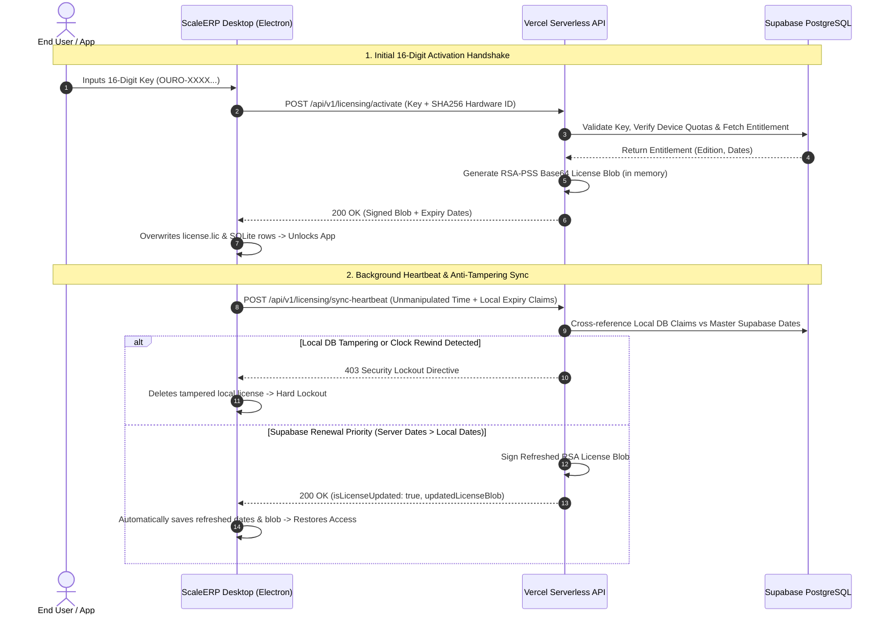

# ScaleERP Web & Cloud: Application Context & Integration

## 1. Why the Website Exists

The `scaleerp-web` platform serves as the central commercial, operational, and security hub for the ScaleERP software ecosystem. Specifically, it fulfills four fundamental roles:

1. **Commercial Front-Door & Marketing**: It is the public landing page showcasing value propositions, core features (inventory tracking, supplier/customer ledgers, advanced invoice printing), pricing tiers, and customer testimonials to prospective buyers.
2. **Lead Generation & Sales Engine**: Houses interactive forms (Contact Us, Book a Demo, Enterprise Sales) that feed directly into the Supabase database (`customer_inquiries`) for the support and sales team.
3. **SEO & Knowledge Hub**: Hosts high-speed, markdown-driven blog articles and operational SOPs (Standard Operating Procedures) designed to rank on search engines for inventory management keywords and assist active users with daily workflows.
4. **Zero-Touch Licensing & Security Hub**: Acts as the master authority for cryptographic license generation, automated subscription/maintenance date renewals, device limit enforcement (`max_devices`), and continuous anti-tamper verification.

### 1.1 Architectural Inspiration: The Keel.so Model
To achieve these four distinct roles without creating a chaotic, monolithic codebase, the `scaleerp-web` architecture is heavily inspired by **Keel.so**. The application is structured using a unified modern web framework (Next.js App Router) but logically separated into distinct, modular funnels:
- **`/marketing/`**: The core public-facing site (Home, Product modules, Pricing, About). Focuses heavily on the "Operator" visual dichotomy (Terracotta/Light Mode).
- **`/resources/`**: The SEO-driven content engine. Modeled after Keel's `/feeds` path, this section utilizes standardized Bento Grid cards to deliver targeted articles and use-cases, completely isolated from core app logic.
- **`/docs/`**: The developer and user documentation portal. Maintained within the same Next.js domain (for simplified deployment and SEO consolidation) but cleanly separated into its own routing group for step-by-step SOPs and technical references.

This deliberate separation of concerns ensures that adding heavy SEO content or documentation never risks the stability of the core marketing funnels or the critical licensing APIs.

---

## 2. Main Desktop Application Context

To effectively communicate with ScaleERP, the web layer relies on understanding the core architecture and operational realities of the client desktop application:

- **Target Audience**: Feed store owners, agricultural product distributors, wholesale brokers, and small-to-medium retail businesses operating in offline or rural environments.
- **Client Architecture**: Built using Electron, React 19 (TypeScript), and a local high-performance SQLite database operating in Write-Ahead Logging (WAL) mode.
- **Offline-First Paradigm**: ScaleERP is designed to operate flawlessly with 0% internet connectivity. Transactions, stock audits, ledger calculations, and invoice rendering occur entirely on local hardware.
- **Cryptographic Guard**: The compiled desktop binary strictly embeds an RSA 2048-bit Public Key. It can locally verify cryptographic license blobs (`license.lic`) but requires the Vercel cloud backend (which holds the RSA Private Key) to generate or refresh licenses.

---

## 3. The Communication Layer: Why & How They Communicate

### Why They Communicate
1. **Initial Device Binding**: To bind a specific PC's hardware fingerprint (Hostname + OS + CPU + RAM + MAC) to an entitled 16-digit license key (`OURO-9876-ABCD-4321`).
2. **Automated Remote Renewals (Supabase Priority)**: When an administrator or customer renews a subscription or extends maintenance dates on the Supabase cloud database, the desktop app automatically fetches the newly signed RSA license blob without requiring Anydesk sessions or manual technician file transfers.
3. **Anti-Tampering Enforcement**: To verify that the client has not manipulated local SQLite expiry dates or rewound the operating system clock to bypass license expiration.

### How They Communicate
- **Protocol**: Secure HTTPS REST API calls executed over Node.js or Electron's native `net` module.
- **Payload Security**: All activation and verification handshakes pass SHA-256 hardware fingerprints and unmanipulated time snapshots.
- **Air-Gapped QR Bridge**: If the desktop PC has zero internet access, communication occurs via an on-screen QR code. The user scans it with their mobile phone, opens the Vercel web portal, retrieves a lightweight 1KB `scaleerp.lic` file, and transfers it locally via USB or Bluetooth.

---

## 4. Telemetry & Client Vitals

During the background synchronization handshake (`POST /api/v1/licensing/sync-heartbeat`), the desktop application transmits critical non-sensitive operational telemetry to Supabase. This data is utilized by the web portal to provide proactive support and enterprise analytics:

- **Active Application Version**: Tracks adoption of new ScaleERP releases (e.g. `v1.2.0`).
- **Operating System & Hostname**: Identifies the specific retail workstation or back-office PC.
- **Sync Timestamps**: Records the exact UTC timestamp of the last successful cloud handshake (`last_sync_at`), allowing the support team to see when an offline PC was last online.
- **License State**: Reports whether the client is operating in `VALID`, `GRACE` (View-Only Soft Lock), or `EXPIRED` (Hard Lock) mode.
