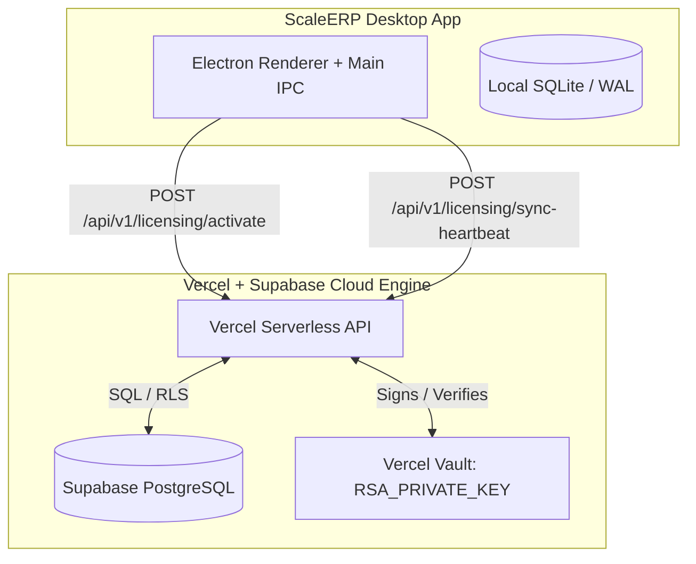

# ScaleERP Web & Cloud Licensing Backend Architecture

## Architectural Overview

The ScaleERP web platform utilizes a **hybrid Next.js App Router architecture**, hosted on **Vercel** (Serverless Functions) and backed by **Supabase** (PostgreSQL Database & Authentication). 

Inspired by the modular, scalable design of **Keel.so**, the architecture is explicitly separated into Next.js route groups (`(marketing)`, `(resources)`, `(docs)`). This allows the application to statically generate (SSG) SEO-heavy marketing and resource pages for lightning-fast delivery, while seamlessly server-rendering (SSR) dynamic APIs and secure portals. 

By operating as a standalone Git repository (`scaleerp-web`), it maintains absolute cryptographic isolation from the desktop Electron client binary while safely powering marketing, SEO blogs, customer lead generation, and continuous zero-touch license verification.



## 1. Cryptographic Isolation & Security Strategy

- **Zero Client-Side Private Keys**: The desktop binary strictly embeds the RSA 2048-bit Public Key (`embeddedPublicKey.ts`). It can verify digital signatures locally but cannot issue or modify licenses.
- **Server-Side Asymmetric Signing**: When activating via a 16-digit license key (`OURO-XXXX-XXXX-XXXX`), Vercel executes an isolated serverless function that securely reads `RSA_PRIVATE_KEY` from encrypted environment variables, validates the hardware fingerprint against Supabase, signs the canonicalized payload, and returns the encrypted Base64 blob.
- **Cloud-Enforced Anti-Tampering Handshake**: When online, the desktop client automatically syncs its time heartbeats and local license timestamps (`valid_from`, `valid_until`, `maintenance_until`) with Supabase. If any local sqlite row manipulation or clock rewind is detected, the cloud backend instantly invalidates the session.

---

## 2. Supabase PostgreSQL Schema Specification

The database utilizes Supabase's native PostgreSQL engine with foreign key constraints, automatic timestamps, and UUID primary keys.

```sql
-- Table 1: Customer Profiles
CREATE TABLE customers (
    id UUID PRIMARY KEY DEFAULT gen_random_uuid(),
    name TEXT NOT NULL,
    email TEXT UNIQUE NOT NULL,
    company_name TEXT,
    phone VARCHAR(20),
    created_at TIMESTAMP WITH TIME ZONE DEFAULT NOW()
);

-- Table 2: 16-Digit License Keys (Master Entitlement & Deadlines)
CREATE TABLE license_keys (
    key_code VARCHAR(19) PRIMARY KEY, -- Formatted as XXXX-XXXX-XXXX-XXXX
    customer_id UUID REFERENCES customers(id) ON DELETE CASCADE,
    edition TEXT NOT NULL CHECK (edition IN ('Basic', 'Pro', 'Enterprise')),
    max_devices INTEGER DEFAULT 1,
    active_devices INTEGER DEFAULT 0,
    valid_from TIMESTAMP WITH TIME ZONE NOT NULL DEFAULT NOW(),
    valid_until TIMESTAMP WITH TIME ZONE NOT NULL,       -- Yearly renewal drop-dead date
    maintenance_until TIMESTAMP WITH TIME ZONE NOT NULL, -- 90-day/1-year support & updates cutoff
    is_revoked BOOLEAN DEFAULT FALSE,
    created_at TIMESTAMP WITH TIME ZONE DEFAULT NOW(),
    updated_at TIMESTAMP WITH TIME ZONE DEFAULT NOW()
);

-- Table 3: Active Device Bindings (Hardware Fingerprints)
CREATE TABLE device_activations (
    activation_id UUID PRIMARY KEY DEFAULT gen_random_uuid(),
    key_code VARCHAR(19) REFERENCES license_keys(key_code) ON DELETE CASCADE,
    device_fingerprint TEXT NOT NULL,
    hostname TEXT,
    activated_at TIMESTAMP WITH TIME ZONE DEFAULT NOW(),
    last_sync_at TIMESTAMP WITH TIME ZONE DEFAULT NOW(),
    license_blob TEXT NOT NULL,
    UNIQUE(key_code, device_fingerprint)
);

-- Table 4: Cloud Heartbeats & Clock Tamper Verification Logs
CREATE TABLE client_heartbeats (
    heartbeat_id UUID PRIMARY KEY DEFAULT gen_random_uuid(),
    key_code VARCHAR(19) REFERENCES license_keys(key_code) ON DELETE CASCADE,
    device_fingerprint TEXT NOT NULL,
    client_system_time TIMESTAMP WITH TIME ZONE NOT NULL, -- Unmanipulated system time reported by client
    server_recorded_time TIMESTAMP WITH TIME ZONE DEFAULT NOW(), -- Exact UTC timestamp when cloud received sync
    reported_valid_until TIMESTAMP WITH TIME ZONE NOT NULL, -- What the local SQLite DB claims is the expiry
    reported_maintenance_until TIMESTAMP WITH TIME ZONE NOT NULL,
    is_tamper_flagged BOOLEAN DEFAULT FALSE,
    tamper_reason TEXT,
    created_at TIMESTAMP WITH TIME ZONE DEFAULT NOW()
);

-- Table 5: Inquiries Lead Management (Contact Us / Book Demo)
CREATE TABLE customer_inquiries (
    inquiry_id UUID PRIMARY KEY DEFAULT gen_random_uuid(),
    inquiry_type TEXT NOT NULL CHECK (inquiry_type IN ('CONTACT_US', 'BOOK_DEMO', 'SALES_ENTERPRISE')),
    name TEXT NOT NULL,
    email TEXT NOT NULL,
    phone VARCHAR(20),
    company_name TEXT,
    message TEXT NOT NULL,
    status TEXT DEFAULT 'NEW' CHECK (status IN ('NEW', 'IN_PROGRESS', 'RESOLVED', 'SPAM')),
    created_at TIMESTAMP WITH TIME ZONE DEFAULT NOW()
);

-- Table 6: Blogs & Knowledge Articles (SEO Engine)
CREATE TABLE blogs (
    slug TEXT PRIMARY KEY,
    title TEXT NOT NULL,
    meta_description TEXT NOT NULL,
    content_md TEXT NOT NULL,
    author TEXT NOT NULL,
    is_published BOOLEAN DEFAULT FALSE,
    published_at TIMESTAMP WITH TIME ZONE DEFAULT NOW(),
    updated_at TIMESTAMP WITH TIME ZONE DEFAULT NOW()
);

-- Table 7: Activation & Security Audit Log
CREATE TABLE activation_logs (
    log_id UUID PRIMARY KEY DEFAULT gen_random_uuid(),
    key_code VARCHAR(19),
    device_fingerprint TEXT,
    ip_address TEXT,
    status TEXT CHECK (status IN ('SUCCESS', 'FAILED_EXPIRED', 'FAILED_DEVICE_LIMIT', 'FAILED_INVALID_KEY', 'SECURITY_TAMPER_LOCK')),
    attempted_at TIMESTAMP WITH TIME ZONE DEFAULT NOW()
);
```

---

## 3. Vercel Serverless API Specification

### Endpoint 1: `POST /api/v1/licensing/activate`

**Description**: Handshake endpoint called by ScaleERP desktop app when a user inputs their 16-digit activation key.

#### Request Payload
```json
{
  "activationKey": "OURO-9876-ABCD-4321",
  "deviceFingerprint": "sha256-hash-of-hardware-components",
  "hostname": "DESKTOP-RETAIL-01"
}
```

#### Validation & Business Logic Pipeline
1. **Sanitization**: Validate key format (`^[A-Z0-9]{4}-[A-Z0-9]{4}-[A-Z0-9]{4}-[A-Z0-9]{4}$`).
2. **Master Entitlement Lookup**: Query `license_keys` for `key_code = activationKey`.
3. **Revocation & Expiry Audit**: Ensure `is_revoked = false` and `valid_until > NOW()`.
4. **Device Quota Management**: Verify if `device_fingerprint` already exists. If new, verify `active_devices < max_devices` and increment count.
5. **Cryptographic Blob Generation**:
   - Retrieve immutable deadlines from `license_keys`.
   - Construct canonicalized JSON payload:
     ```json
     {
       "license_id": "uuid",
       "customer_id": "uuid",
       "edition": "Pro",
       "valid_from": "2026-05-18T00:00:00.000Z",
       "valid_until": "2027-05-18T00:00:00.000Z",
       "maintenance_until": "2026-08-18T00:00:00.000Z",
       "device_fingerprint": "sha256-hash..."
     }
     ```
   - Sign payload using `crypto.sign('SHA256', buffer, process.env.RSA_PRIVATE_KEY)`.
   - Base64 encode envelope `{ payload, signature, key_id: "key_001" }`.

#### Success Response (200 OK)
```json
{
  "success": true,
  "licenseBlob": "eyJwa...500_chars_base64...",
  "validUntil": "2027-05-18T00:00:00.000Z",
  "maintenanceUntil": "2026-08-18T00:00:00.000Z",
  "edition": "Pro"
}
```

---

### Endpoint 2: `POST /api/v1/licensing/sync-heartbeat` (Anti-Tamper & Verification)

**Description**: Automatic background sync called by the desktop app when internet connectivity is present. Verifies local time integrity and cross-references local SQLite license timestamps against the cloud source of truth.

#### Request Payload
```json
{
  "activationKey": "OURO-9876-ABCD-4321",
  "deviceFingerprint": "sha256-hash...",
  "clientSystemTime": "2026-05-18T23:25:00.000Z",
  "localDatabaseState": {
    "reportedValidFrom": "2026-05-18T00:00:00.000Z",
    "reportedValidUntil": "2027-05-18T00:00:00.000Z",
    "reportedMaintenanceUntil": "2026-08-18T00:00:00.000Z"
  }
}
```

#### Verification Rules & Supabase Priority Enforcement
1. **Supabase as Absolute Source of Truth**: Query `license_keys` in Supabase. The timestamps in Supabase (`valid_from`, `valid_until`, `maintenance_until`) **always take strict priority** over what the client local SQLite database reports.
2. **Seamless Automatic Renewal Sync**:
   - **IF** Supabase contains dates that are *later* than what the client app reported (e.g., an administrator extended `maintenance_until` or the customer paid for a yearly renewal on the website portal):
   - **ACTION**: Vercel dynamically generates a freshly signed RSA license blob with the updated dates and returns `{"isLicenseUpdated": true, "updatedLicenseBlob": "...", "newValidUntil": "...", "newMaintenanceUntil": "..."}`.
   - **CLIENT REACTION**: The desktop app automatically intercepts this response, overwrites `license.lic` and its local SQLite rows, and instantly restores full application access without requiring Anydesk sessions or manual technician file transfers!
3. **Local DB Manipulation Detection**:
   - **IF** the client reports a `valid_until` or `maintenance_until` date *later* than the immutable record in Supabase (e.g., user altered SQLite row to push expiry to 2099):
   - **ACTION**: Set `is_tamper_flagged = true` in `client_heartbeats`. Return `{"securityLockout": true, "reason": "DATABASE_MANIPULATION_DETECTED"}`. The desktop app immediately deletes the tampered local license, dropping into Hard Lockout.
4. **Clock Rewind Detection**:
   - **IF** `clientSystemTime` is significantly earlier than `server_recorded_time - 24 hours` (e.g. user set PC clock back to 2024 to bypass expiry):
   - **ACTION**: Set `is_tamper_flagged = true`, log anomaly, and return lockout directive.
5. **Normal Execution**: If timestamps align perfectly, update `last_sync_at` in `device_activations`.

#### Response Payload (Example: Renewal Automatic Update)
```json
{
  "success": true,
  "securityLockout": false,
  "serverTime": "2026-05-18T23:35:10.450Z",
  "isLicenseUpdated": true,
  "updatedLicenseBlob": "eyJwa...new_500_chars_base64...",
  "newValidUntil": "2028-05-18T00:00:00.000Z",
  "newMaintenanceUntil": "2027-08-18T00:00:00.000Z"
}
```

---

### Endpoint 3: `POST /api/v1/inquiries` (Lead Generation)

**Description**: Public endpoint receiving submissions from the website's Contact Us or Book Demo forms.

#### Request Payload
```json
{
  "inquiryType": "BOOK_DEMO",
  "name": "Rajesh Pawar",
  "email": "rajesh@agrotech.com",
  "phone": "919876543210",
  "companyName": "Pawar Feeds & Agro",
  "message": "Looking for a multi-user enterprise license for 5 retail outlets."
}
```

#### Business Logic
1. Sanitize inputs, enforce rate-limiting by IP to prevent spam.
2. Insert row into `customer_inquiries` table with status `'NEW'`.
3. (Optional) Trigger email/webhook notification to sales support team.

#### Success Response
```json
{ "success": true, "inquiryId": "uuid-1234", "message": "Inquiry recorded successfully. Our team will contact you shortly." }
```

---

### Endpoint 4: `GET /api/v1/blogs` & `GET /api/v1/blogs/[slug]` (SEO Engine)

**Description**: Public high-speed endpoints serving pre-rendered markdown content for Next.js static site generation (SSG) or server-side rendering (SSR).

#### Response (List)
```json
{
  "blogs": [
    {
      "slug": "inventory-management-best-practices-2026",
      "title": "Top 5 Inventory Management Best Practices for Feed Stores in 2026",
      "metaDescription": "Learn how modern desktop inventory software eliminates stockouts and improves ledger accuracy for agricultural suppliers.",
      "author": "ScaleERP Editorial",
      "publishedAt": "2026-05-15T10:00:00.000Z"
    }
  ]
}
```

---

## 4. Offline (Air-Gapped) Activation Fallback

For completely offline PCs, the user scans an on-screen QR code pointing to `https://scaleerp.com/activate?fp=hash123`.
1. The mobile browser opens the Vercel web portal.
2. The user enters their 16-digit activation key on their phone.
3. Vercel executes the exact same validation pipeline and generates the signed RSA blob in Supabase.
4. **Transfer Mechanism**: The mobile web app triggers a download of `scaleerp.lic` (1KB file). The user transfers this file from their smartphone to the offline PC via USB cable, Bluetooth, or local Wi-Fi direct, preserving pure 2048-bit RSA security without manual string typing.

---

## 5. Security Environment Requirements

Vercel Environment Variables required for production deployment:
- `SUPABASE_URL`: `https://xxxxxx.supabase.co`
- `SUPABASE_SERVICE_ROLE_KEY`: Secret service key for bypassing RLS in secure serverless backend routes.
- `RSA_PRIVATE_KEY`: Complete PEM-formatted 2048-bit RSA private key string.
- `WEBHOOK_SECRET`: Secret for validating Stripe / Razorpay webhook notifications on successful purchases.
